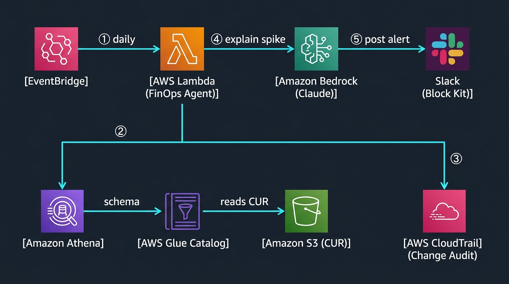

# Cloud Cost Anomaly Agent 💰🤖

An AI agent that watches your AWS bill. Once a day it checks whether any service
suddenly costs more than usual, figures out **what changed** to cause it, asks
Claude to explain the root cause and a fix, and posts it to Slack.

You do nothing. If spend is normal, it stays quiet. If something spikes, you get
a message like this:

```
🔴 AWS Cost Anomaly Detected
Run abc123 · 1 anomaly · 4.2s
──────────────────────────────────────────────
Amazon EC2 · AWS Account
Last full day (2026-08-31): $847.20  (+43.1% vs 7-day avg)
Baseline: $592.10/day · Delta: +$255.10

🔍 Root Cause:
An Auto Scaling policy launched 9 m5.2xlarge nodes at 14:00 UTC.
CPU stayed under 20% — the scale-out was over-aggressive.

💡 Fix:
Cap the node group's max size and revisit the HPA thresholds.
Estimated saving: ~$220/day.
```

---

## How it works



The agent is a small loop. It hands Claude four tools and lets the model use them
in order until it has an answer:

```
                    ┌─────────────────────────────────────────┐
   EventBridge      │                 agent.py                 │
  (daily, 16:00 ───▶│                                          │
    UTC, on         │  1. find_spike_services()  which service │
    a schedule)     │        │                    jumped?      │
                    │        ▼                                 │
                    │  2. get_cost_timeseries()  when did it   │
                    │        │                    start?       │
                    │        ▼                                 │
                    │  3. find_deploys_near_spike()  what      │
                    │        │              changed then?      │
                    │        ▼                                 │
                    │  4. Claude writes root cause + fix       │
                    │        │                                 │
                    │        ▼                                 │
                    │  5. post_slack_alert()  ──────────────────▶ Slack
                    └─────────────────────────────────────────┘
```

If step 1 finds nothing, the agent stops there and posts nothing. No spike, no
noise.

Each numbered step is one file in [`Agent/`](Agent). That's the whole codebase:

| File | Its job |
|---|---|
| [`Agent/agent.py`](Agent/agent.py) | The loop above. Defines the four tools and runs them via Bedrock. |
| [`Agent/aws_athena_cur.py`](Agent/aws_athena_cur.py) | Gets cost data from your CUR (the **CUR mode**, see below). |
| [`Agent/aws_cost_explorer.py`](Agent/aws_cost_explorer.py) | Gets cost data from the Cost Explorer API (the **CE mode**). |
| [`Agent/aws_cloudtrail.py`](Agent/aws_cloudtrail.py) | Finds the infrastructure change that caused a spike. |
| [`Agent/slack_notify.py`](Agent/slack_notify.py) | Builds and sends the Slack alert. |

---

## Two modes: CE and CUR

The agent can read your spend from one of two sources. **You pick with a single
environment variable, `COST_PROVIDER`.** Everything else is identical — the loop,
the CloudTrail correlation, the Slack alert.

| | **CE mode** (`COST_EXPLORER`) | **CUR mode** (`ATHENA_CUR`) |
|---|---|---|
| **Reads from** | Cost Explorer API | Cost & Usage Report in S3, via Athena |
| **Setup** | None — works immediately | Enable CUR + create one Athena table (one-time) |
| **Detail** | Per-service daily totals | Per-resource, hourly, pricing models |
| **Best for** | One account, getting started | Many accounts, or you want resource-level detail |
| **Cost per run** | ~$0.02 (one API call) | ~$0.005 (Athena scans a few MB) |
| **This is the default** | ✅ | set `COST_PROVIDER=ATHENA_CUR` |

> **New to this? Use CE mode.** It needs zero setup. Move to CUR mode later when
> you want per-resource detail or you're covering an AWS Organization.

Both modes flag two kinds of anomaly:

1. **A jump in an existing service** — today is ≥ `SPIKE_THRESHOLD_PCT`% above its
   own 7-day average.
2. **A brand-new cost source** — a service with no prior spend suddenly costs more
   than `NEW_SERVICE_USD` in a day. (A new service has no baseline to take a
   percentage of, so it's judged on absolute dollars.)

Both compare against the **last complete day**, never today — today is always
partial, and comparing a partial day to a full-day average would hide real spikes.

---

## Run it locally (2 minutes, CE mode)

You need AWS credentials with `ce:GetCostAndUsage`, `cloudtrail:LookupEvents`, and
`bedrock:InvokeModel`, plus a Slack incoming webhook.

```bash
# 1. Install (only boto3 is needed; the Lambda runtime already has it)
pip install -r requirements.txt

# 2. Point it at your Slack webhook
cp .env.example .env.local          # then edit SLACK_WEBHOOK_URL

# 3. Run one check
cd Agent
SLACK_WEBHOOK_URL=$(grep SLACK_WEBHOOK_URL ../.env.local | cut -d= -f2) \
  python -c "import agent; print(agent.NativeAWSFinOpsAgent().run())"
```

A normal account prints a summary and posts nothing. That's success.

---

## Deploy it (runs itself, forever)

One CloudFormation file, [`infra/finops-agent.yaml`](infra/finops-agent.yaml),
deploys everything: the Lambda, a daily schedule, and the IAM permissions.

```bash
# 1. Package the agent (5 files, no dependencies to bundle)
cd Agent && zip -r ../agent.zip . -x "__pycache__/*" && cd ..

# 2. Upload it somewhere the stack can read
aws s3 cp agent.zip s3://YOUR_BUCKET/lambda/agent.zip

# 3. Deploy
aws cloudformation deploy \
  --template-file infra/finops-agent.yaml \
  --stack-name finops-agent \
  --capabilities CAPABILITY_NAMED_IAM \
  --parameter-overrides \
    SlackWebhookUrl="https://hooks.slack.com/services/..." \
    CodeS3Bucket=YOUR_BUCKET \
    CodeS3Key=lambda/agent.zip
```

That's it. The agent now runs every day at 16:00 UTC. To change the schedule, cost
mode, or thresholds, override the matching parameter — they're all documented at
the top of the template.

### Remove everything

```bash
python scripts/teardown.py --yes
```

Deletes the stack (Lambda, schedule, IAM) and the Athena table. Your CUR export and
its data are left alone.

---

## Setting up CUR mode

Only needed if you want per-resource detail. Two one-time steps:

1. **Enable a Cost & Usage Report** delivering to an S3 bucket, with the Athena
   integration enabled.
2. **Create one Athena table** over that data. This project uses **partition
   projection**, so there's no Glue crawler to run, schedule, or pay for — Athena
   computes the partitions at query time.

Then confirm it works before deploying:

```bash
ATHENA_DATABASE=your_db ATHENA_TABLE=your_table \
ATHENA_OUTPUT_LOCATION=s3://your-bucket/athena-results/ \
  python scripts/validate_athena.py
```

The validator checks each piece — table exists, schema detected, real data returns,
detection runs — and tells you exactly what's wrong if a step fails.

---

## Configuration

| Variable | Default | Description |
|---|---|---|
| `COST_PROVIDER` | `COST_EXPLORER` | `COST_EXPLORER` (CE) or `ATHENA_CUR` (CUR). |
| `SLACK_WEBHOOK_URL` | *(required)* | Slack incoming webhook. |
| `BEDROCK_MODEL_ID` | `us.anthropic.claude-sonnet-4-6` | Bedrock model / inference profile. |
| `SPIKE_THRESHOLD_PCT` | `25.0` | % above baseline that counts as a spike. |
| `NEW_SERVICE_USD` | `5.0` | Daily $ at which a brand-new service is flagged. |
| `MIN_BASELINE_USD` | `1.0` | Ignore services averaging less than this/day (noise floor). |
| `AGENT_MAX_ITERATIONS` | `8` | Max Bedrock loop turns (a safety cap). |
| `AWS_BEDROCK_REGION` | `us-east-1` | Region for Bedrock. |
| `FINOPS_AWS_REGION` | `us-east-1` | Region for CUR/CloudTrail/Athena. Not `AWS_REGION` — that name is reserved by Lambda and can't be set on a function. |

**CUR mode only:**

| Variable | Default | Description |
|---|---|---|
| `ATHENA_DATABASE` | — | Glue database holding the CUR table. |
| `ATHENA_TABLE` | — | The CUR table name. |
| `ATHENA_OUTPUT_LOCATION` | *(workgroup default)* | S3 path for Athena query results. |
| `ATHENA_WORKGROUP` | `primary` | Athena workgroup to run in. |

---

## Project layout

```
Agent/                  the agent — 5 files, nothing else
  agent.py              the loop
  aws_athena_cur.py     CUR mode cost data
  aws_cost_explorer.py  CE mode cost data
  aws_cloudtrail.py     what changed
  slack_notify.py       the alert
infra/
  finops-agent.yaml     one-command deploy
scripts/
  validate_athena.py    check your CUR setup
  teardown.py           one-command delete
tests/
  test_native_agent.py  the tests
```

---

## Cost to run

Running daily, forever, in CUR mode: **~$2–3/month**, almost all of it Bedrock.
Athena, Lambda, EventBridge, and CloudTrail are effectively free at this volume,
and partition projection means there's no Glue crawler bill.

---

## License

MIT
